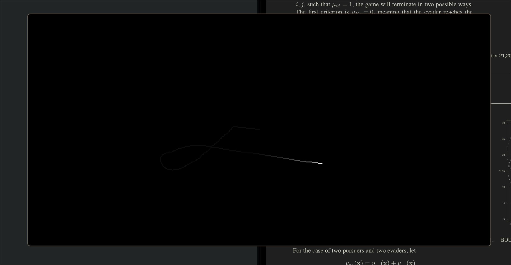
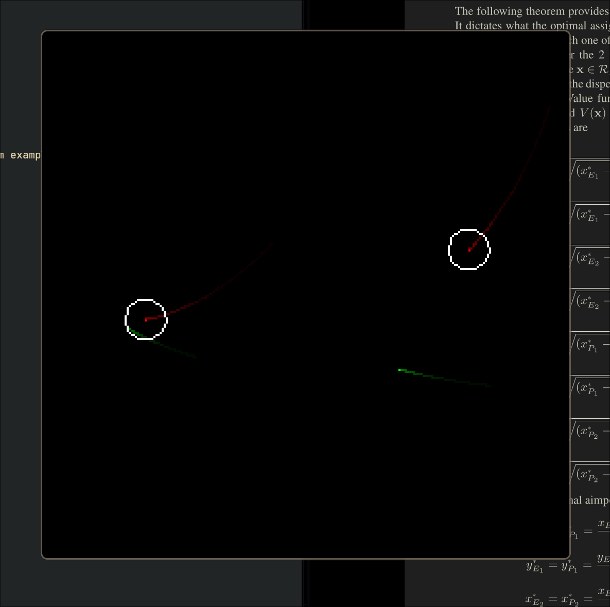

# Differential Game Simulator

A simple C simulator and renderer for working with differential games. Based on
SDL2.

## Building

To build the entire project, just run `make` in the project directory. This will
compile the entire library and all the example binaries.

## Examples

Included examples can be found in the `examples/` directory. To make a specific
example, you can use `make <example>` where `<example>` is the name of the
example's directory.

Ex: to build and run the `particle` example, you can use:
```console
$ make particle
$ ./bin/particle
```

**In all games, you can press 'q' or 'Esc' to quit the simulation.** For
specific information about the example you're using, run the example with the
`-h` flag:

```console
./bin/particle -h
```

### Particle

A particle which follows your mouse forever.



### 2 Pursuers 2 Evaders

An example of a 2 pursuer, 2 evader differential game.

Press 'r' to toggle showing the capture radius of the pursuers.


